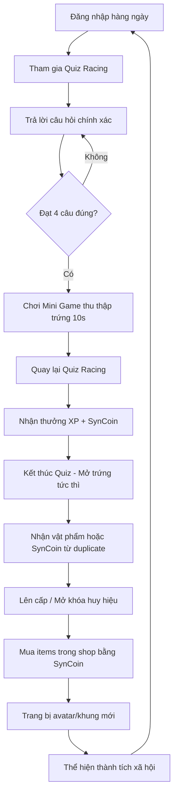

# 🎮 SYNLEARNIA GAME MECHANICS - TÀI LIỆU CHI TIẾT

**Cập nhật:** 07/08/2025  
**Phiên bản:** 2.0 - Synchronized với GAME_SYSTEM_SYNLEARNIA.md  
**Trạng thái:** Đã đồng bộ với hệ thống game mới

## 📁 Cấu trúc Thư mục

```
game-mechanics/
├── README.md                           # Tổng quan hệ thống (cập nhật mới)
├── 01-progression-system.md            # Hệ thống Cấp độ & Huy hiệu
├── 02-customization-system.md          # Tùy chỉnh & Thể hiện
├── 03-collection-system.md             # Trứng Thưởng & Sưu Tầm (Mini Game)
├── 04-social-system.md                 # Tương tác Xã hội
├── 05-economy-system.md                # Hệ thống Tiền tệ & Kinh tế (SynCoin duy nhất)
├── 06-quiz-racing-system.md            # Cuộc Đua Quiz Tốc Độ với Mini Game
├── SYNC_REPORT.md                      # Báo cáo đồng bộ hệ thống
└── TIER_LIST_SYSTEM.md                 # Phân cấp nội dung
```

## 🔗 Mối Quan Hệ Giữa Các Hệ Thống

### Luồng Chính (Core Flow)

```
Người chơi → Quiz Racing → Mini Game (4 câu đúng) → Thu Thập Trứng
     ↓                                                      ↓
Nhận SynCoin + XP → Lên Cấp → Mở Trứng Tức Thì → Vật Phẩm/SynCoin
     ↓                                                      ↓
Mua Vật Phẩm Trong Shop ← ← ← ← ← ← ← ← ← ← ← ← ← ← ← ← ← ← ←
```

### Các Kết Nối Quan Trọng

1. **Quiz Racing** → **Economy**: Nhận SynCoin từ quiz performance
2. **Mini Game** → **Collection**: Thu thập trứng khi đạt 4 câu đúng
3. **Collection** → **Economy**: Vật phẩm trùng lặp tự động chuyển thành SynCoin
4. **Progression** → **Customization**: Cấp độ mở khóa avatar và huy hiệu
5. **Social** → **Collection**: Emoji từ trứng thưởng
6. **Economy** → **Shop**: SynCoin mua avatar, khung, emoji hiếm

## 📊 Các Chỉ Số Quan Trọng (KPIs)

### Engagement Metrics

- **Quiz Participation Rate**: % người chơi tham gia quiz mỗi ngày
- **Mini Game Activation Rate**: Tần suất kích hoạt mini game (4 câu đúng)
- **Collection Completion**: % hoàn thành bộ sưu tập avatar/emoji

### Economic Metrics

- **SynCoin Circulation**: Lượng SynCoin được kiếm và tiêu mỗi ngày
- **Duplicate Conversion Rate**: Tỷ lệ vật phẩm trùng lặp chuyển thành SynCoin
- **Shop Conversion**: % người chơi mua items từ cửa hàng

### Progression Metrics

- **Level Distribution**: Phân bố cấp độ của người chơi
- **Tier Achievement**: % đạt các tầng huy hiệu
- **Retention by Tier**: Tỷ lệ giữ chân theo từng tầng

## 🎯 Mục Tiêu Thiết Kế

### Ngắn Hạn (1-2 tuần)

- Người chơi làm quen với Quiz Racing và mini game
- Tích lũy SynCoin đầu tiên
- Mở khóa avatar và huy hiệu cơ bản

### Trung Hạn (1-3 tháng)

- Đạt tầng Silver/Gold
- Sưu tầm đa dạng avatar từ trứng và shop
- Tham gia cạnh tranh bảng xếp hạng

### Dài Hạn (3+ tháng)

- Master tier với hiệu ứng tên đặc biệt
- Hoàn thành bộ sưu tập avatar, khung, emoji
- Trở thành cao thủ Quiz Racing

## 🔄 Vòng Lặp Game Chính



## 📈 Chiến Lược Monetization (Tương lai)

### Single Currency Economy (SynCoin)

- Kiếm được qua Quiz Racing performance
- Thu từ vật phẩm trùng lặp (duplicate conversion)
- Tạo giá trị cho nỗ lực học tập

### Progression Acceleration (Tùy chọn)

- Boost XP trong thời gian ngắn
- Extra mini game chances
- Không ảnh hưởng competitive balance

### Cosmetics Premium

- Khung avatar độc quyền
- Hiệu ứng tên đặc biệt
- Limited edition items

---

**📝 Ghi chú**: Hệ thống được thiết kế đơn giản với SynCoin duy nhất, tập trung vào học tập và mini game thu thập trứng.

**🔗 Liên kết**: Xem [GAME_SYSTEM_SYNLEARNIA.md](../GAME_SYSTEM_SYNLEARNIA.md) để hiểu đầy đủ hệ thống game mới.
