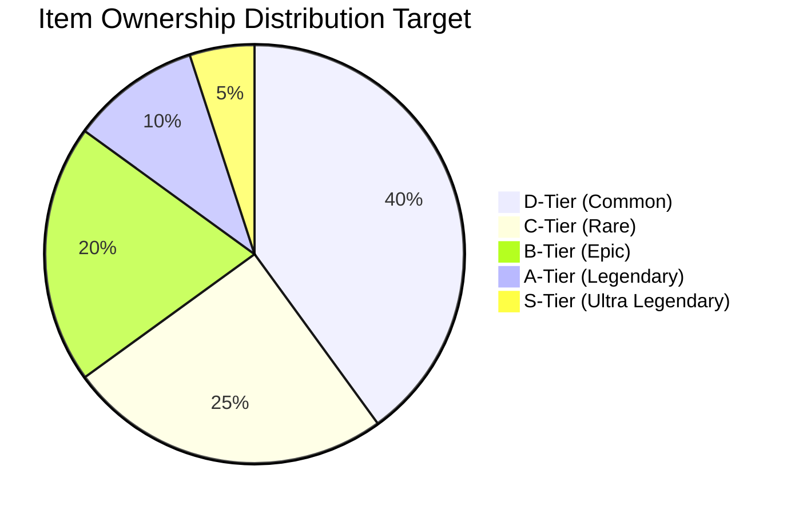

# 🏆 SYNLEARNIA TIER LIST (Display-only) & ITEM CLASSIFICATION

Ngày: 08/08/2025  
Phiên bản: 3.1 — Đồng bộ GAME_SYSTEM + configs (eggs-config, shop-config, scoring-config, reward-config)  
Trạng thái: Tier chỉ để hiển thị/truyền thông; không có multiplier kinh tế; egg công bằng, mở tức thì.

## 📋 Mục tiêu của Tier System

- Chuẩn hóa phân hạng hiếm (rarity) và mức độ danh giá cho item theo cảm nhận/hiển thị.
- Không tác động kinh tế: tier KHÔNG tăng XP/SynCoin, KHÔNG tăng tỉ lệ rơi egg/item.
- Phản ánh đúng nguồn mở khóa: level, egg mini game, hoặc shop — theo các file config.

## 🔑 Nguyên tắc cốt lõi (theo GAME_SYSTEM)

- Single currency: SynCoin. Công thức điểm/XP/coin do server quyết định theo config; KHÔNG có tier multiplier theo cấp/tier người chơi.
- Eggs: chỉ đến từ mini game kích hoạt mỗi 4 câu đúng (tính trên toàn trận), thời lượng ~10s; mở trứng tức thì khi kết thúc trận; eggs KHÔNG bán trong shop; tỉ lệ rơi công bằng, độc lập level (levelIndependent: true); KHÔNG có “golden variant”.
- Nguồn mở khóa:
  - Avatar: 1 avatar nền tảng do người chơi chọn + một phần mở theo level (xem level-config.json) + item hiếm/độc qua egg hoặc shop.
  - Frame: qua egg hoặc shop (không buộc theo level).
  - Emoji: qua egg hoặc shop.
- Duplicate item chuyển thành SynCoin theo eggs-config. Giá trong shop lấy từ shop-config (không hard-code trong tài liệu này).

## 🎯 Ý nghĩa các tier (hiển thị)

- S / A / B / C / D: phân nhóm danh giá-hiếm gặp để người chơi định hướng sưu tầm. Chỉ hiển thị, không buff.
- Gợi ý phân loại: dựa trên độ hiếm trong egg pools, mức giá tương đối trong shop, và độ đặc sắc hình ảnh.

## 🥚 Tỉ lệ egg và pool phần thưởng (theo eggs-config.json)

- Tỉ lệ loại trứng (basis=10000):

  - Basic Egg: 8500 → 85.00%
  - Royal Egg: 1200 → 12.00%
  - Legendary Egg: 250 → 2.50%
  - Dragon Egg: 50 → 0.50%

- Tỉ lệ item bên trong mỗi loại egg (tổng weight mỗi pool ≈ 10000):
  - Basic Egg: avatar(Common) 60% • emoji(Common) 30% • XP 8% • Coin 2%
  - Royal Egg: avatar(Uncommon|Rare) 60% • emoji(Rare) 30% • frame(Basic) 10%
  - Legendary Egg: avatar(Rare|Epic) 70% • emoji(Epic) 20% • frame(Premium) 10%
  - Dragon Egg: avatar(Epic|Legendary) 70% • emoji(Legendary) 20% • frame(Premium) 10%

Lưu ý về rarity trong pool: khi một mục có nhiều rarity (ví dụ ["Uncommon","Rare"]) mà không có trọng số riêng, mặc định chia đều. Có thể mở rộng schema để thêm rarityWeights nếu cần.

## 🐾 Hướng dẫn xếp hạng Tier theo nguồn (ví dụ)

- S-Tier (Ultra hiếm):
  - Chủ yếu rơi từ Dragon Egg hoặc Legendary Egg với rarity cao (Epic/Legendary, Premium frame).
  - Tỉ lệ sở hữu mục tiêu <1% (mang tính định hướng, không ràng buộc kinh tế).
- A-Tier (Hiếm):
  - Rơi từ Legendary/Royal Egg hoặc bán trong shop ở nhóm giá cao (xem shop-config.json).
- B/C/D-Tier:
  - B: chất lượng tốt, rơi từ Royal/Legendary hoặc shop giá trung; C: phổ biến vừa; D: phổ thông/cơ bản.

Gợi ý hiển thị theo config:

- Frames (đồng bộ shop-config): hiện có ocean-song-frame, drumalong-festival-frame, cyber-glitch-frame, nation-of-pyro-frame, violet-starlight-frame, crimson-phoenix-frame. Giá hiển thị lấy trực tiếp từ shop-config và có thể thay đổi theo vận hành.
- Emojis/Avatars: xuất hiện trong egg theo pools ở trên; một phần avatar mở theo level (level-config), phần hiếm qua egg/shop.

## 😀 Emoji & 🖼️ Frame & 🐾 Avatar — ghi chú ngắn

- Emoji: nhận qua egg hoặc mua shop; không ràng buộc tier người chơi; giá định nghĩa trong shop-config.
- Frames: chỉ qua egg hoặc shop; không có unlock theo level; Premium frame có trong Legendary/Dragon egg pools.
- Avatars: người chơi chọn avatar nền tảng; một số mở theo level (level-config), còn lại hiếm qua egg/shop.

## 🎮 Quiz Racing Performance Tier (mô tả — không buff)

- Dành cho truyền thông và mục tiêu kỹ năng (S/A/B/C/D theo hiệu suất), KHÔNG áp dụng multiplier XP/SynCoin theo tier.
- Phần thưởng thực tế tuân theo scoring-config + reward-config: base points theo độ khó, bonus tốc độ, streak, câu đặc biệt; coin/XP do server tính toán; mini game mở khi đạt mốc 4 câu đúng (tính trên toàn trận).
- Không có bảo đảm egg theo tier hiệu suất; chỉ phụ thuộc ngưỡng mini game và cấu hình tỉ lệ trong eggs-config.

## 💰 Giá trị kinh tế (điều khiển bằng config)

- Giá item: xem shop-config.json; eggs không bán (policy.sellEggs=false).
- Duplicate conversion: xem eggs-config.json (duplicateConversion theo loại/rarity).
- Không đưa bảng giá cố định trong tài liệu; vận hành điều chỉnh trực tiếp ở config để cân bằng kinh tế.

## 🎯 Mốc sưu tầm (gợi ý)

- Avatars: 10/30 • 20/30 • 25/30 • 30/30 (tùy bộ hiện có). Nguồn: level-config + egg/shop.
- Frames: mốc 2 • 4 • 6 khung. Giá trị phụ thuộc shop-config và độ hiếm trong egg.
- Emojis: 25 • 50 • 75 • 100+ theo bộ sưu tập hiện hành.

## 📊 Phân phối mục tiêu theo tier (tham chiếu)

## ✅ Kiểm chứng cân bằng (theo GAME_SYSTEM)

- Tier chỉ hiển thị, không multiplier kinh tế.
- Eggs công bằng, độc lập level; mở tức thì; không golden variant.
- XP/coin tính theo server + scoring/reward configs.
- Nguồn unlock bám sát level-config (avatar), eggs-config (tỉ lệ/pool), shop-config (giá/chính sách).

---

Gợi ý triển khai:

1. Inventory hiển thị nhãn tier theo rarity/nguồn từ configs.
2. Badge/mốc sưu tầm cập nhật từ tiến độ thực tế.
3. Analytics theo dõi tỉ lệ sở hữu để điều chỉnh pools/giá bằng config.
