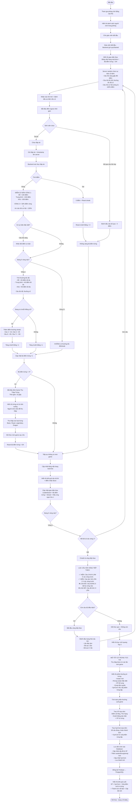

```mermaid
flowchart TD
    Start([Bắt đầu]) --> JoinRoom[Tham gia phòng chờ bằng mã PIN]
    JoinRoom --> ShowPlayers[Hiển thị danh sách người chơi trong phòng]
    ShowPlayers --> WaitStart[Chờ giáo viên bắt đầu]

    WaitStart --> QuizStart[Giáo viên bắt đầu - Backend gửi quizStarted]
    QuizStart --> InitRace[Hiển thị giao diện đua:<br/>Bảng xếp hạng real-time + Bộ đếm trứng 🥚 0/4]

    InitRace --> CheckRandomEvents["Server random chọn sự kiện cố định:<br/>- Câu hỏi vàng gấp đôi điểm<br/>- Câu hỏi tốc độ: thưởng tốc độ x2<br/>- Câu hỏi cơ hội (vòng 2): 100% điểm"]
    CheckRandomEvents --> NewQuestion["Nhận câu hỏi mới + đánh dấu sự kiện nếu có"]
    NewQuestion --> StartTimer[Bắt đầu đếm ngược thời gian]
    StartTimer --> PlayerChoice{"Sinh viên chọn"}

    PlayerChoice -->|Trả lời| Answer[Chọn đáp án]
    PlayerChoice -->|Bỏ qua câu hỏi này| SkipQuestion[Đánh dấu câu bỏ qua - 0 điểm]

    Answer --> SubmitAnswer[Gửi đáp án + timestamp lên server]
    SubmitAnswer --> ValidateAnswer[Backend xác thực đáp án]

    ValidateAnswer --> CalcScore{"Tính điểm"}
    CalcScore -->|Đúng| BasePoints["ĐIỂM CƠ BẢN VÒNG 1:<br/>Dễ: +100 điểm<br/>Trung bình: +150 điểm<br/>Khó: +200 điểm<br/><br/>VÒNG 2+: 50% điểm vòng 1<br/>trừ câu hỏi cơ hội = 100%"]
    CalcScore -->|Sai| NoPoints["0 điểm + Reset streak"]

    BasePoints --> CheckEventMultiplier{"Có sự kiện đặc biệt?"}
    CheckEventMultiplier -->|Câu hỏi vàng| DoublePoints[Nhân đôi điểm cơ bản]
    CheckEventMultiplier -->|Không| CheckRoundForBonus{"Đang ở vòng nào?"}

    DoublePoints --> CheckRoundForBonus
    CheckRoundForBonus -->|Vòng 1| CalcSpeedBonus["Tính thưởng tốc độ:<br/>- Dễ: +30 điểm tối đa<br/>- Trung bình: +40 điểm tối đa<br/>- Khó: +50 điểm tối đa<br/><br/>Câu tốc độ: thưởng x2"]
    CheckRoundForBonus -->|Vòng 2+| SkipBonus[KHÔNG có thưởng tốc độ/streak]

    CalcSpeedBonus --> CheckStreak{"Đang có chuỗi thắng ≥3?"}
    CheckStreak -->|Có| AddStreakBonus["Thêm điểm thưởng streak:<br/>Câu 4: +15, Câu 5: +25<br/>Câu 6: +35, Câu 7+: +50"]
    CheckStreak -->|Không| UpdateStreak[Tăng chuỗi thắng +1]

    AddStreakBonus --> IncreaseStreak[Tăng chuỗi thắng +1]
    IncreaseStreak --> UpdateEggCounter[Cập nhật bộ đếm trứng +1]
    UpdateStreak --> UpdateEggCounter
    SkipBonus --> UpdateEggCounter

    NoPoints --> ResetStreak[Reset chuỗi thắng = 0]
    ResetStreak --> SkipEggCounter[Không cộng bộ đếm trứng]
    SkipQuestion --> SkipEggCounter

    UpdateEggCounter --> CheckEggReady{"Bộ đếm trứng = 4?"}
    CheckEggReady -->|Có| StartMiniGame["Bắt đầu Mini Game Thu Thập Trứng<br/>Thời gian: 10 giây"]
    CheckEggReady -->|Không| SkipMiniGame[Tiếp tục không có mini game]
    SkipEggCounter --> SkipMiniGame

    StartMiniGame --> PlayEggGame["Hiển thị trứng rơi từ trên xuống<br/>Người chơi click để thu thập"]
    PlayEggGame --> CollectEggs["Thu thập các loại trứng:<br/>Basic, Royal, Legendary, Dragon"]
    CollectEggs --> EndMiniGame[Kết thúc mini game sau 10s]
    EndMiniGame --> ResetEggCounter[Reset bộ đếm trứng = 0/4]
    ResetEggCounter --> SkipMiniGame

    SkipMiniGame --> UpdateLeaderboard[Cập nhật bảng xếp hạng real-time]

    UpdateLeaderboard --> ShowResults[Hiển thị kết quả câu trả lời + điểm nhận được]
    ShowResults --> UpdateRaceUI[Cập nhật giao diện đua:<br/>Leaderboard + Bộ đếm trứng + Streak + Hiệu ứng ngọn lửa 🔥]

    UpdateRaceUI --> CheckRound{"Đang ở vòng nào?"}

    %% VÒNG 1: Hiện tất cả câu hỏi tuần tự
    CheckRound -->|Vòng 1| CheckRound1End{"Hết tất cả câu vòng 1?"}
    CheckRound1End -->|Còn câu| CheckRandomEvents
    CheckRound1End -->|Hết| PrepareNextRound[Chuẩn bị vòng tiếp theo]

    %% LOGIC VÒNG 2+ - Áp dụng nguyên tắc chung
    PrepareNextRound --> FilterQuestions[LỌC CÂU HỎI VÒNG TIẾP THEO:<br/><br/>✅ HIỆN: Câu CHƯA LÀM ở các vòng trước<br/>✅ HIỆN: Câu làm SAI LẦN 1 ở các vòng trước<br/>❌ LOẠI BỎ: Câu ĐÚNG ở bất kỳ vòng nào<br/>❌ LOẠI BỎ: Câu đã SAI 2+ LẦN]

    FilterQuestions --> CheckEligible{"Còn câu đủ điều kiện?"}
    CheckEligible -->|Có| StartNextRound[Bắt đầu vòng tiếp theo]
    CheckEligible -->|Không| QuizCompleted[Kết thúc quiz - Không còn câu]

    StartNextRound --> MarkQuestionStatus["Đánh dấu trạng thái câu hỏi:<br/>- Lần đầu làm<br/>- Đã sai 1 lần<br/>- Đã sai 2+ lần"]
    MarkQuestionStatus --> CheckRandomEvents

    %% KẾT THÚC VÀ TRAO THƯỞNG
    QuizCompleted --> ShowPodium[Hiển thị bục vinh quang Top 3]
    ShowPodium --> OpenEggsInstantly["MỞ TẤT CẢ TRỨNG TỨC THÌ<br/>Thu thập được từ các lần mini game"]

    OpenEggsInstantly --> ShowEggRewards["Hiển thị phần thưởng từ trứng:<br/>- Avatar mới<br/>- Khung avatar đặc biệt<br/>- XP bổ sung<br/>- Emoji độc quyền<br/>- SynCoin nếu vật phẩm trùng lặp"]

    ShowEggRewards --> CalcFinalRewards[Tính toán phần thưởng cuối game]

    CalcFinalRewards --> GiveXP["Trao XP dựa trên:<br/>Điểm số tổng, Thứ hạng<br/>Chuỗi thắng dài nhất<br/>+ XP từ trứng"]
    GiveXP --> GiveSynCoin["Trao SynCoin dựa trên:<br/>Số câu đúng, Hoàn thành quiz<br/>+ SynCoin từ vật phẩm trùng lặp"]

    GiveSynCoin --> SaveProgress["Lưu tiến trình vào Database:<br/>- Cập nhật cấp độ & XP<br/>- Thêm avatar/khung/emoji mới<br/>- Cập nhật SynCoin<br/>- Lưu thành tích"]

    SaveProgress --> SyncData[Đồng bộ Firebase → PostgreSQL]
    SyncData --> ShowFinalResults["Hiển thị kết quả cuối:<br/>XP + SynCoin + Vật phẩm mới từ trứng<br/>+ Thành tích nổi bật + Cấp độ mới"]
    ShowFinalResults --> End([Kết thúc - Quay về lobby])

    class JoinRoom,ShowPlayers,WaitStart preparation
    class CheckRandomEvents,NewQuestion,StartTimer,PlayerChoice,Answer,SubmitAnswer gameplay
    class CalcScore,BasePoints,CalcSpeedBonus,CheckStreak,AddStreakBonus,UpdateStreak,CheckRoundForBonus,SkipBonus,CheckEventMultiplier,DoublePoints scoring
    class StartMiniGame,PlayEggGame,CollectEggs,EndMiniGame,UpdateEggCounter,CheckEggReady minigame
    class UpdateLeaderboard,UpdateRaceUI realtime
    class OpenEggsInstantly,ShowEggRewards,CalcFinalRewards,GiveXP,GiveSynCoin,ShowFinalResults rewards
    class FilterQuestions,CheckEligible,MarkQuestionStatus logic
```
