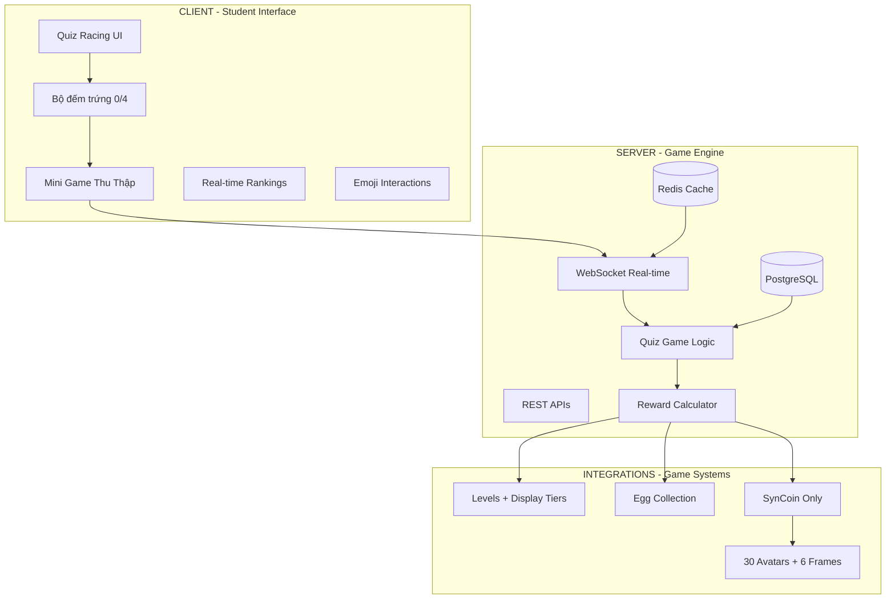
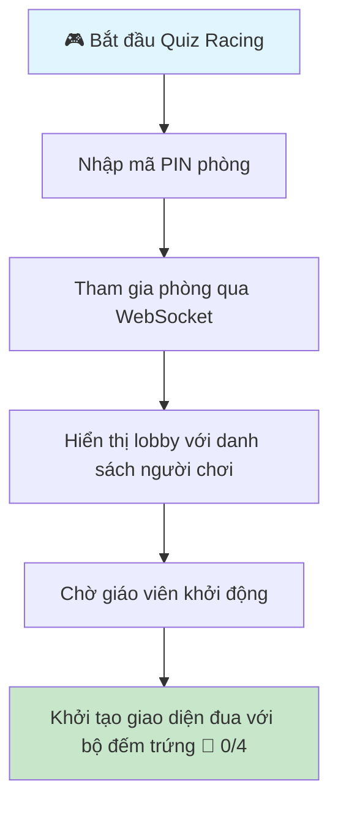
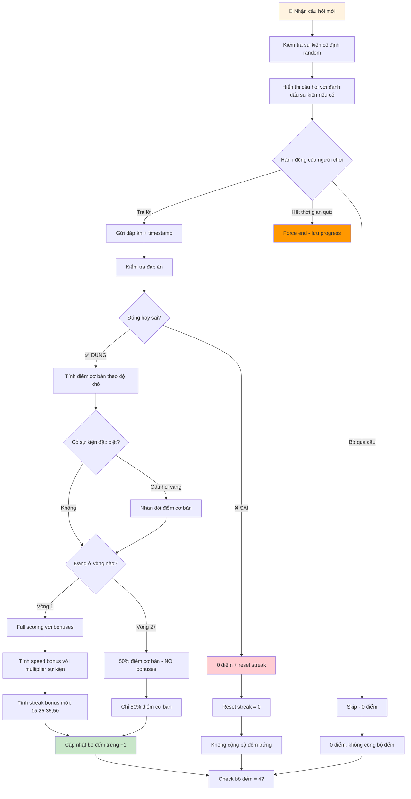
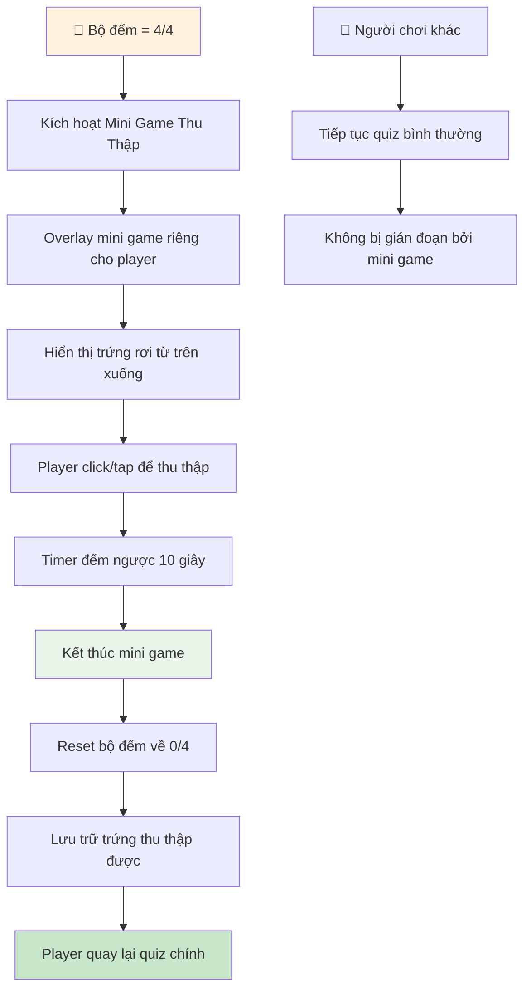
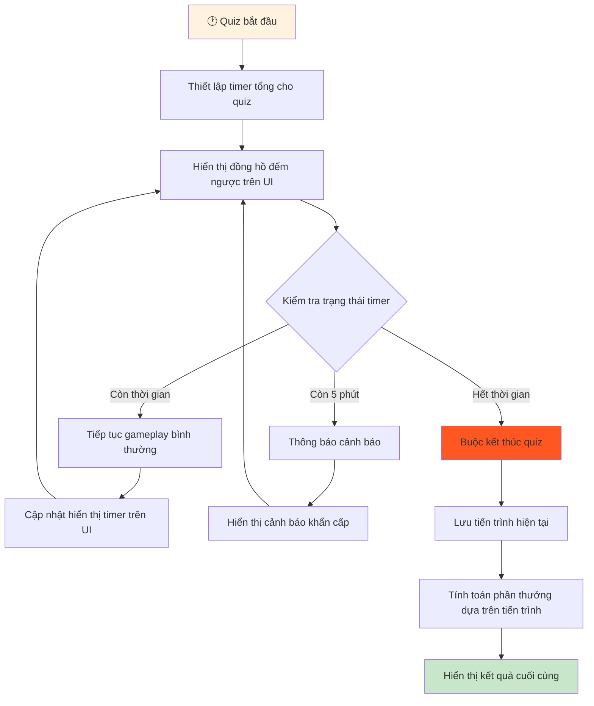
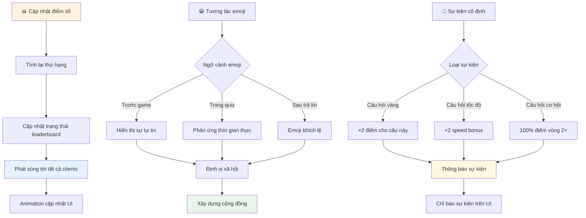
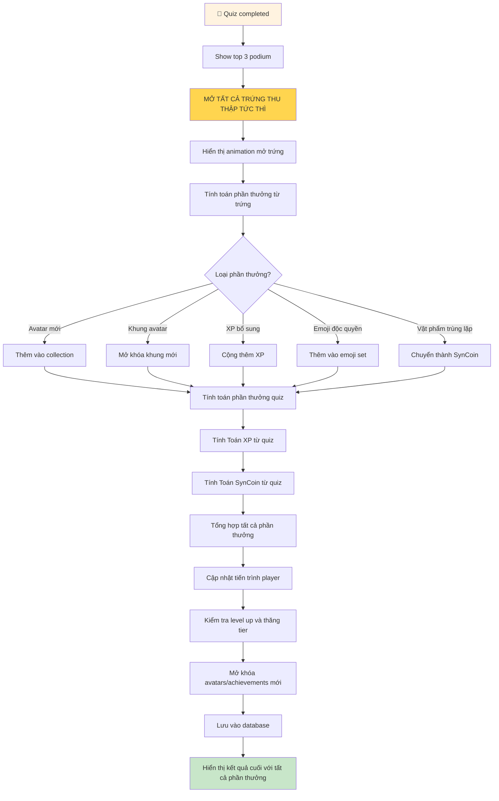
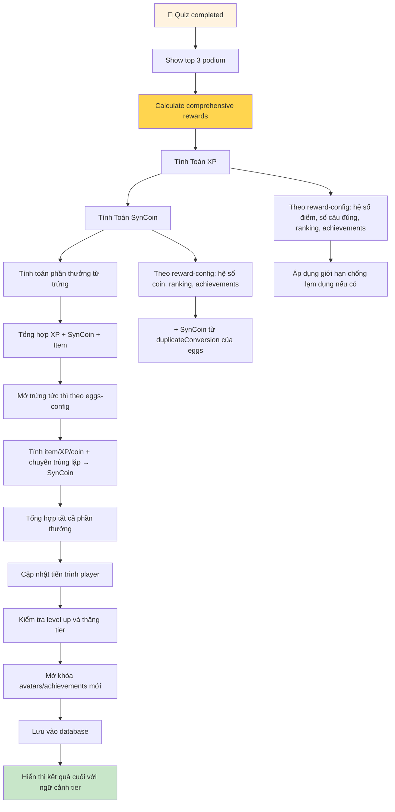

# 🏁 QUIZ RACING - HƯỚNG DẪN TRIỂN KHAI HOÀN CHỈNH

## 🎯 Mục Tiêu & Vị Trí Trong Hệ Thống

**Quiz Racing là trung tâm của toàn bộ platform Synlearnia:**

- **Nguồn XP duy nhất:** 100% XP đến từ quiz performance
- **Nguồn currency chính:** Thu nhập SynCoin từ hoàn thành quiz và vật phẩm trùng lặp
- **Engine thu thập:** Tất cả trứng thưởng từ mini game thu thập
- **Hệ thống xã hội:** Real-time interaction với emoji system
- **Mở trứng tức thì:** Tự động mở tất cả trứng thu thập được khi kết thúc quiz

> **Dependencies:** Quiz Racing kết nối với tất cả 5 systems khác: [01-Progression](01-progression-system.md), [02-Customization](02-customization-system.md), [03-Collection](03-collection-system.md), [04-Social](04-social-system.md), [05-Economy](05-economy-system.md). Công thức điểm/coin/XP do server quyết định theo configs: scoring-config.json, reward-config.json. Eggs theo eggs-config.json; giá shop theo shop-config.json.

## 📋 TỔNG QUAN KIẾN TRÚC HỆ THỐNG



---

## 🔄 QUY TRÌNH QUIZ RACING - 5 MODULE TÍCH HỢP

### MODULE 1: KHỞI TẠO & THAM GIA PHÒNG



**Chuẩn bị tham gia:**

- **Đơn giản hóa:** Không cần chọn skills, chỉ tham gia với PIN
- **Giao diện sạch:** Hiển thị avatar, huy hiệu và bộ đếm trứng
- **Chờ đợi:** Lobby hiển thị tất cả participants với thông tin cấp độ
- **Sẵn sàng:** Hệ thống auto-start khi giáo viên bắt đầu

### MODULE 2: LUỒNG TÍNH ĐIỂM & BỘ ĐẾM TRỨNG



**Quy tắc tính điểm chi tiết:**

**🎯 Điểm cơ bản theo độ khó:**

- **Dễ:** 100 điểm (vòng 1) → 50 điểm (vòng 2+)
- **Trung bình:** 150 điểm (vòng 1) → 75 điểm (vòng 2+)
- **Khó:** 200 điểm (vòng 1) → 100 điểm (vòng 2+)

**⚡ Speed bonus (chỉ vòng 1):**

- **Dễ:** Tối đa +30 điểm (trong 5s đầu)
- **Trung bình:** Tối đa +40 điểm (trong 5s đầu)
- **Khó:** Tối đa +50 điểm (trong 5s đầu)
- **Câu hỏi tốc độ:** Nhân đôi speed bonus

**🔥 Streak bonus mới (chỉ vòng 1):**

- Streak 4: +15 điểm
- Streak 5: +25 điểm
- Streak 6: +35 điểm
- Streak 7+: +50 điểm

**🥚 Bộ đếm trứng:**

- **Trả lời đúng:** Bộ đếm +1 (0/4 → 1/4 → 2/4 → 3/4 → 4/4)
- **4 câu đúng:** Kích hoạt mini game thu thập trứng 10 giây
- **Reset:** Bộ đếm về 0/4 sau mỗi lần mini game
- **Sai/Skip:** Không cộng bộ đếm

**🌟 Sự kiện cố định:**

- **Câu hỏi vàng:** Gấp đôi điểm cơ bản (được đánh dấu cho tất cả)
- **Câu hỏi tốc độ:** Speed bonus nhân đôi (được đánh dấu cho tất cả)
- **Câu hỏi cơ hội:** Vòng 2 được 100% điểm thay vì 50% (được đánh dấu cho tất cả)

### MODULE 3: MINI GAME THU THẬP TRỨNG



**Cơ chế Mini Game:**

**🎮 Gameplay:**

- **Kích hoạt:** Khi bộ đếm đạt 4/4 (4 câu trả lời đúng)
- **Thời gian:** 10 giây chính xác
- **Giao diện:** Overlay riêng, không ảnh hưởng người khác
- **Thu thập:** Click/tap vào trứng rơi để thu thập
- **Tốc độ:** Trứng rơi với tốc độ khác nhau

**🥚 Loại trứng có thể thu thập (theo eggs-config):**

- **Basic Egg:** Phổ biến
- **Royal Egg:** Hiếm hơn
- **Legendary Egg:** Rất hiếm
- **Dragon Egg:** Cực hiếm

**⚖️ Công bằng:**

- **Tỉ lệ như nhau:** Tất cả người chơi có cơ hội thu thập như nhau
- **Skill-based:** Phụ thuộc vào khéo léo click/tap
- **Không advantage:** Cấp độ không ảnh hưởng tỉ lệ rơi
- **Reset counter:** Sau mỗi lần chơi, bộ đếm reset về 0/4

### MODULE 4: QUẢN LÝ THỜI GIAN & TIMER



**Tính Năng Timer System:**

- **Timer toàn quiz:** Giới hạn thời gian tổng do giáo viên đặt
- **Timer từng câu:** Không bắt buộc giới hạn cứng; speed bonus áp dụng trong cửa sổ 5 giây đầu (hết cửa sổ thì bonus=0 nhưng vẫn trả lời được)
- **Hệ thống cảnh báo:** Báo động players 5 phút trước deadline
- **Tự động hoàn thành:** Buộc kết thúc khi hết thời gian
- **Bảo toàn tiến trình:** Lưu tất cả câu trả lời và tiến trình khi hết thời gian
- **Phần thưởng công bằng:** Tính toán dựa trên số câu đã hoàn thành

**Ghi Chú Quan Trọng:**

- **Từng câu hỏi:** Không có áp lực vội vàng, học sinh có thể suy nghĩ kỹ
- **Deadline tổng thể:** Tạo cảm giác khẩn cấp cho việc hoàn thành quiz
- **Tốc độ linh hoạt:** Học sinh tự kiểm soát tốc độ trả lời
- **An toàn:** Không mất tiến trình do giới hạn thời gian

### MODULE 4: BẢNG XẾP HẠNG & TƯƠNG TÁC XÃ HỘI



**Tính Năng Real-time:**

**📊 Bảng Xếp Hạng Động:**

- Cập nhật vị trí ngay lập tức sau mỗi câu trả lời
- Animation UI mượt mà cho thay đổi vị trí
- Hiển thị bộ đếm trứng cho tất cả players
- Chỉ báo streak và hiệu ứng ngọn lửa 🔥

**😀 Hệ Thống Emoji (100+ emojis):**

- **Nguồn mở khóa:** Qua eggs hoặc mua tại shop (không phụ thuộc tier/cấp)
- **Sử dụng theo ngữ cảnh:** Tự tin trước game, phản ứng trong quiz, ăn mừng sau game
- **Giao tiếp an toàn:** Chỉ emoji để tránh quấy rối văn bản
- **Địa vị xã hội:** Emoji hiếm xuất hiện trong Legendary/Dragon Egg hoặc item shop giá cao

**🌟 Sự Kiện Cố Định:**

- **Câu hỏi vàng:** Server random chọn 1 câu hỏi cố định, tất cả người chơi thấy cùng câu được đánh dấu vàng và nhận ×2 điểm
- **Câu hỏi tốc độ:** Server random chọn 1 câu hỏi cố định, tất cả người chơi thấy cùng câu được đánh dấu và speed bonus nhân đôi
- **Câu hỏi cơ hội:** Server random chọn 1 câu ở vòng 2, tất cả người chơi thấy cùng câu và được 100% điểm thay vì 50%

**Tích Hợp Xã Hội:**

- **Chia sẻ thành tích:** Ăn mừng real-time các cột mốc quan trọng
- **Nhận diện tier:** Chỉ báo trạng thái trực quan cho tiến trình
- **Trưng bày bộ sưu tập:** Hiển thị avatars/frames hiếm
- **Củng cố tích cực:** Emoji khích lệ xây dựng cộng đồng

### MODULE 5: REWARD CALCULATION & MỞ TRỨNG TỨC THÌ



**Hệ Thống Phần Thưởng Hoàn Toàn Mới:**

**🥚 Mở Trứng Tức Thì:**

```
Khi Quiz Kết Thúc:
1. Tự động mở TẤT CẢ trứng thu thập được từ mini game
2. Hiển thị animation mở trứng cho từng quả
3. Tính toán phần thưởng từ mỗi trứng:
   - Avatar mới → Thêm vào collection
   - Khung avatar đặc biệt → Mở khóa
   - XP bổ sung → Cộng vào tổng XP
   - Emoji độc quyền → Thêm vào bộ sưu tập
   - Vật phẩm trùng lặp → Tự động chuyển thành SynCoin
```

**💫 Phần Thưởng XP & 🪙 SynCoin (Server-authoritative):**

- Công thức và hệ số do server áp dụng theo reward-config.json (ví dụ: hệ số theo tổng điểm, số câu đúng, ranking, achievements; có giới hạn chống lạm dụng).
- XP và SynCoin từ trứng: tính theo eggs-config (XP/coin trong pools) và duplicateConversion (vật phẩm trùng lặp → SynCoin).
- Không dùng tier multipliers theo cấp/tier người chơi.

**🎁 Phần Thưởng Từ Trứng:**

- **Avatar mới:** Các avatar độc quyền không mở khóa bằng cấp độ
- **Khung avatar đặc biệt:** Khung viền hiếm có
- **XP bổ sung:** Lượng XP ngẫu nhiên giúp lên cấp nhanh hơn
- **Emoji độc quyền:** Biểu tượng cảm xúc vui nhộn
- **SynCoin:** Từ vật phẩm trùng lặp tự động chuyển đổi

### MODULE 7: TỔNG HỢP PHẦN THƯỞNG & HOÀN THÀNH



**Nguyên tắc phần thưởng:**

- Chỉ 1 loại tiền tệ: SynCoin. Không có Kristal.
- Không áp dụng tier multipliers theo cấp/tier người chơi.
- Eggs chỉ đến từ mini game (kích hoạt mỗi 4 câu đúng), không bán trong shop, mở tức thì khi kết thúc quiz.
- Item/XP/coin từ eggs theo eggs-config; duplicateConversion chuyển vật phẩm trùng lặp → SynCoin.

**Tích Hợp Với Các Hệ Thống Khác:**

- **Tiến Trình Level:** XP từ quiz tăng cấp; tiers chỉ hiển thị.
- **Mở Khóa Avatar:** Một phần theo level-config + item hiếm qua eggs/shop.
- **Kinh Tế:** SynCoin duy nhất; giá bán theo shop-config.
- **Bộ Sưu Tập:** Eggs cung cấp avatars/frames/emojis; shop bổ sung lựa chọn.

---

## 📡 CÁC SỰ KIỆN WEBSOCKET CẦN XỬ LÝ

### Client gửi lên Server:

- **join-room**: Tham gia phòng với PIN (không cần skills)
- **submit-answer**: Gửi đáp án kèm thời gian trả lời (để tính thưởng tốc độ)
- **skip-question**: Bỏ qua câu hỏi hiện tại
- **player-ready**: Báo sẵn sàng cho vòng tiếp theo
- **heartbeat**: Ping để duy trì kết nối

### Server gửi xuống Client:

- **quiz-started**: Bắt đầu quiz với danh sách câu hỏi và sự kiện cố định
- **new-question**: Câu hỏi mới với đánh dấu sự kiện (vàng/tốc độ/cơ hội)
- **question-result**: Kết quả câu trả lời và điểm nhận được
- **leaderboard-update**: Cập nhật bảng xếp hạng với bộ đếm trứng
- **egg-counter-update**: Cập nhật bộ đếm trứng cho từng player
- **mini-game-trigger**: Kích hoạt mini game thu thập trứng cho player cụ thể
- **mini-game-end**: Kết thúc mini game và reset bộ đếm
- **global-event**: Thông báo sự kiện cố định (câu vàng, tốc độ, cơ hội)
- **round-complete**: Hoàn thành vòng, chuẩn bị vòng tiếp theo
- **quiz-time-warning**: Cảnh báo thời gian còn lại của bài quiz
- **quiz-time-expired**: Hết thời gian bài quiz - kết thúc tự động
- **quiz-complete**: Kết thúc quiz với mở trứng tức thì

---

## 🏗️ CẤU TRÚC DATABASE CẦN THIẾT

### Bảng chính cần có:

- **quiz_sessions**: Lưu thông tin phiên quiz (ID, PIN, giáo viên, trạng thái)
- **player_answers**: Lưu câu trả lời của từng người chơi
- **egg_collections**: Lưu trứng thu thập được từ mini game
- **player_stats**: Thống kê điểm số, streak, bộ đếm trứng theo thời gian thực
- **global_events**: Lưu các sự kiện cố định (câu vàng, tốc độ, cơ hội)

### Dữ liệu cần theo dõi:

- Trạng thái câu hỏi của từng người chơi (chưa làm/đúng/sai/số lần sai)
- Điểm số và thứ hạng theo thời gian thực
- Chuỗi thắng hiện tại và dài nhất
- Bộ đếm trứng hiện tại (0-4) cho từng player
- Danh sách trứng thu thập được từ mini game
- Sự kiện cố định đã được chọn random cho quiz
- Thời gian bắt đầu và thời gian còn lại của bài quiz
- Trạng thái kết nối của người chơi

---

_Tài liệu này cung cấp roadmap rõ ràng để triển khai từng module một cách độc lập và tích hợp dần vào hệ thống hoàn chỉnh._
